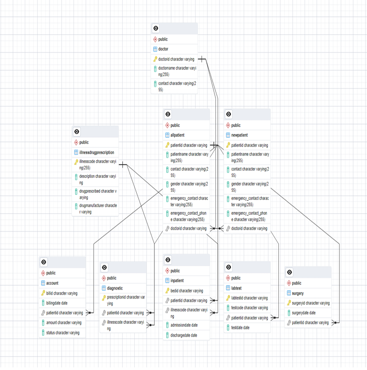
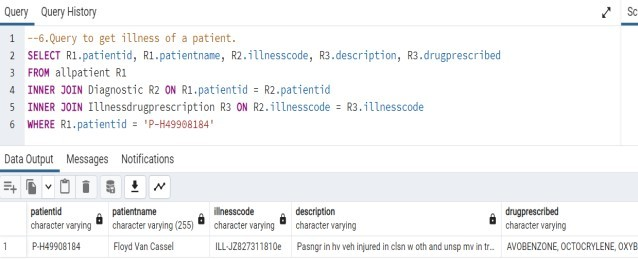
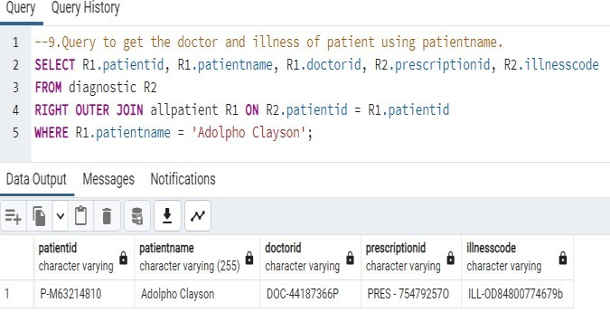
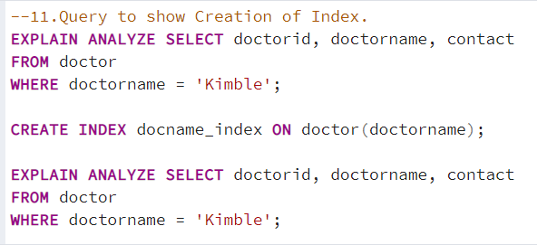
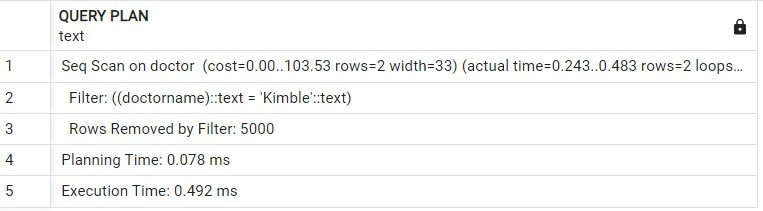
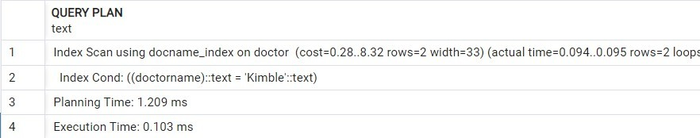
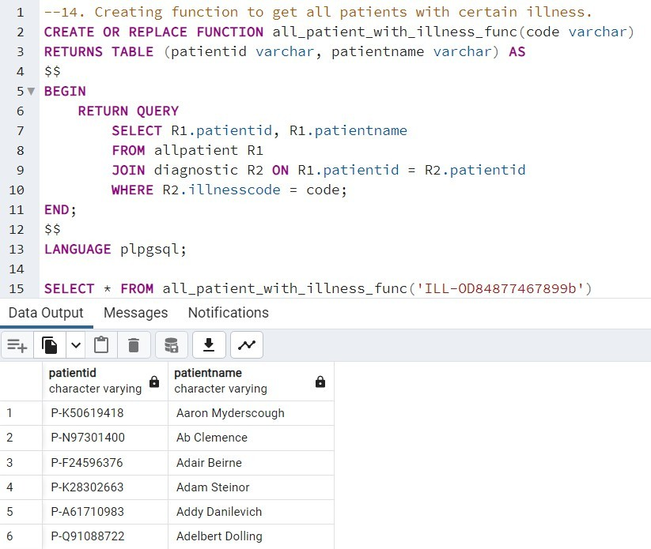

<h1 align="center">Healthcare Database in Postgres SQL</h1>

## 🚀 About:

This system aims to develop a centralized database for managing patient data across various departments in a medical facility, such as the General Patient Department, Inpatient Department, Pharmacy, Surgery Department, and Doctor's Department. By transitioning from traditional data management methods like Excel files to a robust database system, the goal is to enhance the efficiency, accuracy, and accessibility of patient information. The use of primary and foreign keys will ensure seamless integration of data across departments, streamlining hospital operations and improving patient care. This approach provides a unified and error-free way to manage patient records, benefiting both staff and patients.

## 🗃️ Database Design:

The database consists of several tables that collectively manage patient data in a medical facility. The patient table contains essential information about the patient, including patient ID, name, contact details, gender, and emergency contact information.

The doctor table stores details about doctors, such as doctor ID, name, contact information, and their areas of expertise. The illness & drug prescribed table tracks prescriptions, including prescription ID, patient ID, illness details, a description of the illness, prescribed drugs, and the manufacturer of the drugs.

The lab tests table records the test ID, patient ID, and the date of the test conducted. The inpatient table manages information related to hospital stays, including bed ID, patient ID, illness, admission date, and discharge date.

The surgery table contains information about surgeries, such as surgery ID, patient ID, patient name, illness, the doctor performing the surgery, and the surgery date. Lastly, the billing table manages billing details, including billing ID, patient ID, billing date, billing amount, and status.

The ER Diagram of the Database is given below.

  

## 🛠️Steps:
- Generated data is used for the project. The data has
been generated and stored as a SQL file. The data was
generated from a website name mockaroo. The file of the
generated data is in SQL format. I have created a table
with all columns and then inserted each data to the table. As
each row in the data is different, I have updated certain
rows of the data in order to show certain functionality of the
database. The data in the table hospital data is shown below.
I have added data_generated.sql file for reference.

- The create file creates all tables required for the database

- The load file loads data generated to each table.

- The query file has all the query executed. Run each query individually to see the performance and results.

Run the SQL files in the same order to get the results.

## 📊Querying and Results:

Some of the simple queries and creation of function, triggers and their results are displayed below. 

- The query shown below is used to get the illness of the patient.Two INNER JOINS has been used to JOIN two tables Diagnostic and Illness.

  

- The query below is used to get doctor who treated the patient and illness of the patient. RIGHT OUTER JOIN is used to get results.

  

- Indexing is used in SQL to speed up data retrieval by lowering the number of disk I/O operations. Without the index the query searches the whole table for given information. With index it uses index to get it which is much faster.

  

The results of it after the execution without indexing is shown below. We can see that the cost is 103.53

    

The results after execution of the query when the index is created is shown below. The cost here is 8.32 which is much less when compared to above 103.53.

  

- A function which gives us the names and ID of patients who have same illness is created. This can be used to get names of patients who have contagious diseases and shift them to isolation.

  

## ⚡Technologies and Applications Used:

- `Postgres SQL`
- `SQL Language`
- `Indexes`, `Functions`, `Triggers`
- `Mockaroo -  To generate data for database`
- `Normalization`

## 📈Improvements:

- Can use more indexes as the database becomes larger for efficient retrieval of information.
- Refactor complex queries using subqueries or joins to improve efficiency, especially for aggregations like calculating total billing amounts or patient counts.
- Create triggers to enforce business rules (e.g., preventing duplicate patient records or ensuring proper billing amounts) before inserting or updating data